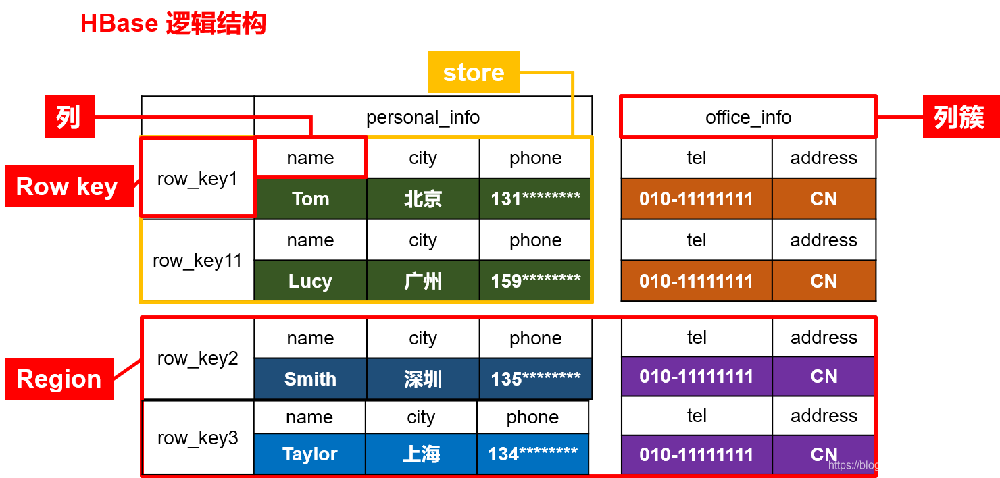
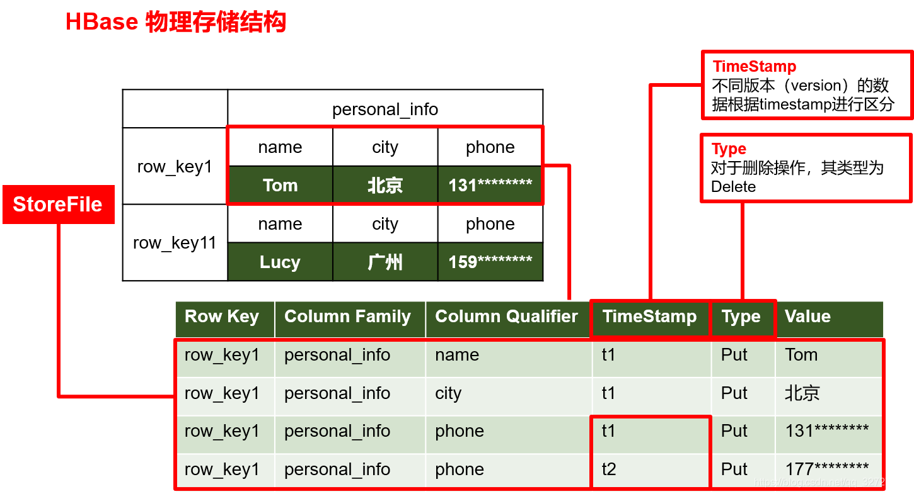

# 1. HBase简介

## 定义

HBase 是一种分布式，可扩展，支持海量数据存储的 NoSQL 数据库

## 数据模型

逻辑上，HBase 的数据模型和关系型数据库很类似，数据存储在一张表中有行有列。但从 HBase 的底层物理存储结构来看，HBase 更像一个 Multi-dimensional map

### 逻辑结构

### 物理结构

### 数据模型

* `Name Space` 命名空间，类似于关系型数据库的 database 概念，每个命名空间下有多个表。Hbase 有两个自带的命名空间，分别是`hbase`和`default`。`hbase`中存放的是 Hbase 内置的表，`default`表是用户默认使用的命名空间
* `Region` 类似于关系型数据库的表的概念。不同的是，Hbase 定义时只需要声明列族，不需要声明具体的列。这意味着，往Hbase写入数据时，字段可以动态指定。因此 Hbase 能够轻松应对字段变更的场景
* `Row` Hbase 表中的每行数据都有一个`Rowkey`和多个`Column`组成，数据按照`Rowkey`的字典序存储，并且查询数据时只能根据`Rowkey`进行检索，所以`Rowkey`的设计十分重要。
* `Column Family` 列族，Hbase 通过列族划分数据的存储，列族下面可以包含任意多个列，实现灵活的数据存取。列族是由一个一个的列组成，在列数据为空时不会占用空间。Family 下面有多个 Qualifier，所以可以简单理解为，Hbase 中的列是二级列，其中 Family 为第一级列，Qualifier 为第二级列
* `Column` Hbase 中每个列都由 Column Family(列族) 和 Column Qualifier(列限定符) 进行限定，例如 info: name, info: age。建表时只需指名列族，而列限定符不需要预先定义
* `Time stamp` 时间戳，用于标识数据的版本。如果不指定，系统会自动加上此字段，值为写入 Hbase 的时间